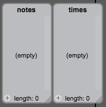
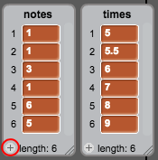
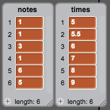

## Store your song

At the moment, notes are removed from the lists after being played, so you're left with empty lists:

You're now going to add code to store songs in your project, so that you don't have to add to your lists each time.

--- task ---
Make a new block called `load 'happy birthday'`{:class="blockmoreblocks"} that clears both the `notes`{:class="blockdata"} and `times`{:class="blockdata"} lists, and then adds the correct numbers back into both lists.
[[[generic-scratch-make-block]]]
--- hints ---
--- hint ---
The `load 'happy birthday'`{:class="blockmoreblocks"} block should `delete all`{:class="blockdata"} items from both the `notes`{:class="blockdata"} and `times`{:class="blockdata"} lists and then `add`{:class="blockdata"} the correct six numbers to the list they belong in, in the correct order.
--- /hint ---
--- hint ---
Here are the code blocks you need:

--- /hint ---
--- hint ---
This is what your code should look like:

--- /hint ---
--- /hints ---
--- /task ---

--- task ---
Test your new block by running it at the start of your project.

Each of your lists should now contain six numbers.

--- /task ---
