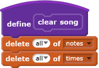
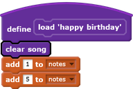
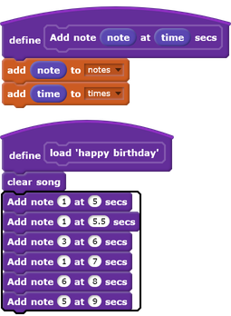

## More custom blocks

The newest section of code is difficult to read, so you're going to use more custom blocks to make it simpler.

--- task ---
Make another block called `clear song`{:class="blockmoreblocks"} that deletes all items from both lists. Use this block before adding numbers back intothe lists.

When you test your code, it should work just as it did before.

--- /task ---

--- task ---
So that your code is even easier to read, make another block that allows you to specify a note to be played and a time to play the note at.

[[[generic-scratch-make-block-parameters]]]

--- hints ---
--- hint ---
Make a block that takes a number as `note`{:class="blockdata"} and a number as `time`{:class="blockdata"} and `adds`{:class="blockdata"} each number to the correct list.
--- /hint ---
--- hint ---
This is what your code should look like:

--- /hint ---
--- /hints ---

--- /task ---
