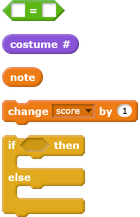
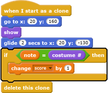
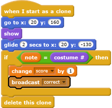
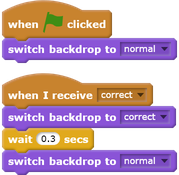

## Keep a score

Improve your game by giving the player points for playing the correct note.

--- task ---
Create a new variable called `score`{:class="blockdata"}, and place it at the top of your Stage.

--- /task ---

--- task ---
Add to `score`{:class="blockdata"} whenever the player plays the correct note at the correct time. Remember to set `score`{:class="blockdata"} to `0`{:class="blockdata"} at the start of the game.

--- hints ---
--- hint ---
`Before each clone is deleted`{:class="blockcontrol"}, it should check to see `if`{:class="blockcontrol"} the `note`{:class="blockdata"} is `equal to`{:class="blockoperators"} the `costume number`{:class="blocklooks"}, and in that case, the score should be `changed`{:class="blockdata"}.
--- /hint ---
--- hint ---
Here are the code blocks you need:

--- /hint ---
--- hint ---
This is what your code should look like:

--- /hint ---
--- /hints ---
--- /task ---

--- task ---
Broadcast a message called 'correct' when the correct note is played.

--- /task ---

--- task ---

Add code to your Stage to briefly change the backdrop when the player plays the correct note. The project already contains a second backdrop for this.

--- /task ---
