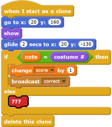

## Challenge: take it further

Your game is done now, but there are a few things you can do to make it even better if you want to!

For example, can you add code to change how the Stage looks if the correct note is not played?

To do this, you need to add code that's very similar to the code that changes the backdrop when the correct note is played. The project contains another backdrop you can use.
